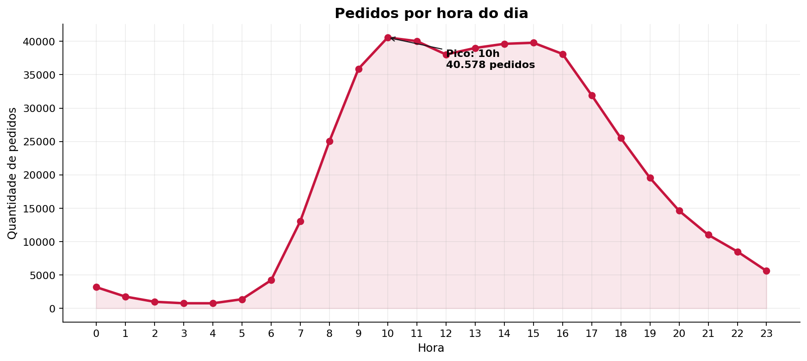
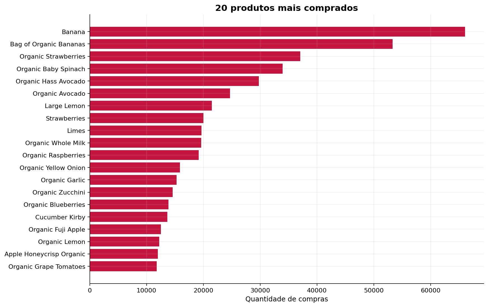

# Instacart Customer Behavior Analysis

Análise exploratória do comportamento de compra de clientes da Instacart, desenvolvida com Python, pandas e Matplotlib a partir de uma amostra educacional modificada.

O projeto reúne **limpeza, validação e manipulação de dados**, além da investigação de padrões de horário, frequência de compra, tamanho das cestas e recompra de produtos.

## Visualização rápida

- [Abrir o notebook executado](notebooks/instacart_customer_behavior_analysis.ipynb)
- [Baixar a versão HTML pronta para visualização](reports/instacart_customer_behavior_analysis.html)



## Objetivo

Validar cinco tabelas relacionadas a pedidos de supermercado e responder perguntas sobre:

- horários e dias com maior volume de pedidos;
- intervalo entre compras;
- quantidade de pedidos por cliente;
- quantidade de itens por pedido;
- produtos mais comprados e recomprados;
- taxa de recompra por produto e por cliente;
- produtos adicionados primeiro ao carrinho.

## Conjunto analisado

Após a limpeza dos registros duplicados, a análise utiliza:

- **478.952 pedidos únicos**;
- **49.694 produtos**;
- **4.545.007 relações entre pedidos e produtos**.

## Principais resultados

- O pico de pedidos ocorre às **10h**, com **40.578 pedidos**.
- Domingo apresenta o maior volume, com **84.090 pedidos**.
- A mediana é de **2 pedidos por cliente**.
- Cada pedido possui mediana de **8 itens** e média de **10,10 itens**.
- `Banana` lidera compras, recompras e produtos adicionados primeiro ao carrinho.
- A comparação normalizada mostra maior concentração relativa de pedidos no sábado entre 12h e 14h.
- O ranking de taxa de recompra considera também o volume de compras, evitando conclusões baseadas em poucos registros.



## Tecnologias

- Python
- pandas
- NumPy
- Matplotlib
- Jupyter Notebook

## Estrutura do repositório

```text
instacart-customer-behavior-analysis/
├── README.md
├── notebooks/
│   └── instacart_customer_behavior_analysis.ipynb
├── reports/
│   └── instacart_customer_behavior_analysis.html
├── data/
│   └── README.md
├── images/
├── requirements.txt
└── .gitignore
```

## Como executar

1. Clone o repositório:

```bash
git clone https://github.com/SEU-USUARIO/instacart-customer-behavior-analysis.git
cd instacart-customer-behavior-analysis
```

2. Crie e ative um ambiente virtual:

```bash
python -m venv .venv
```

No Windows:

```bash
.venv\Scripts\activate
```

No Linux ou macOS:

```bash
source .venv/bin/activate
```

3. Instale as dependências:

```bash
pip install -r requirements.txt
```

4. Coloque os arquivos de dados esperados na pasta `data/`, conforme explicado em [`data/README.md`](data/README.md).

5. Abra o notebook:

```bash
jupyter notebook notebooks/instacart_customer_behavior_analysis.ipynb
```

6. Execute todas as células na ordem.

## Decisões de qualidade

- Caminhos relativos permitem executar o notebook em diferentes computadores.
- Duplicatas são descritas separando linhas envolvidas e cópias excedentes.
- Valores ausentes são tratados de acordo com o significado de cada coluna.
- Comparações entre dias utilizam proporções, e não apenas volumes absolutos.
- Taxas de recompra são acompanhadas por volume mínimo de compras.
- Testes de sanidade validam intervalos, chaves e junções.
- O notebook foi executado integralmente antes da publicação.

## Limitações

O conjunto utilizado foi modificado e reduzido para fins educacionais. Os resultados são descritivos e não representam relações causais nem o comportamento completo da plataforma Instacart.
